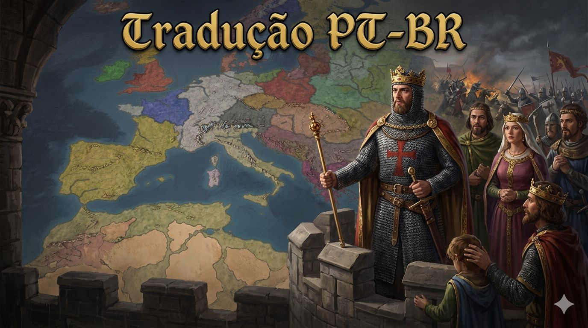

# Traducao PT-BR para Crusader Kings III

Mod de tradução para **Crusader Kings III** que adapta o pacote de localization em espanhol para **português do Brasil**, traduzindo a experiencia completa do jogo para PT-BR.

## Sobre o mod

Este projeto substitui os arquivos de localization usados pelo jogo, mantendo a estrutura de mod do Crusader Kings III e entregando textos em portugues brasileiro para menus, eventos, interfaces, descricoes e demais conteudos localizados.

## Instalacao

1. Baixe ou clone este repositorio.
2. Copie a pasta `ck3_traducao_brazpor` e o arquivo `ck3_traducao_brazpor.mod` para a pasta de mods do Crusader Kings III.
3. Ative o mod no launcher do jogo.

## Compatibilidade

Versao suportada do jogo: `1.19.*`

## Creditos

Projeto mantido por Emerson Antunes.
